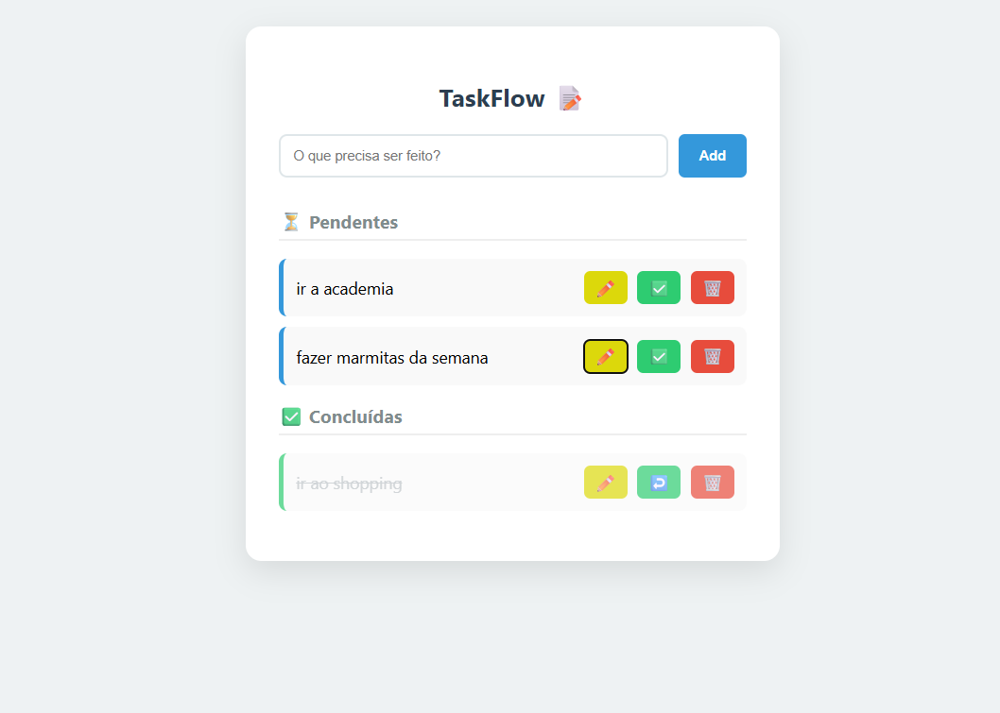
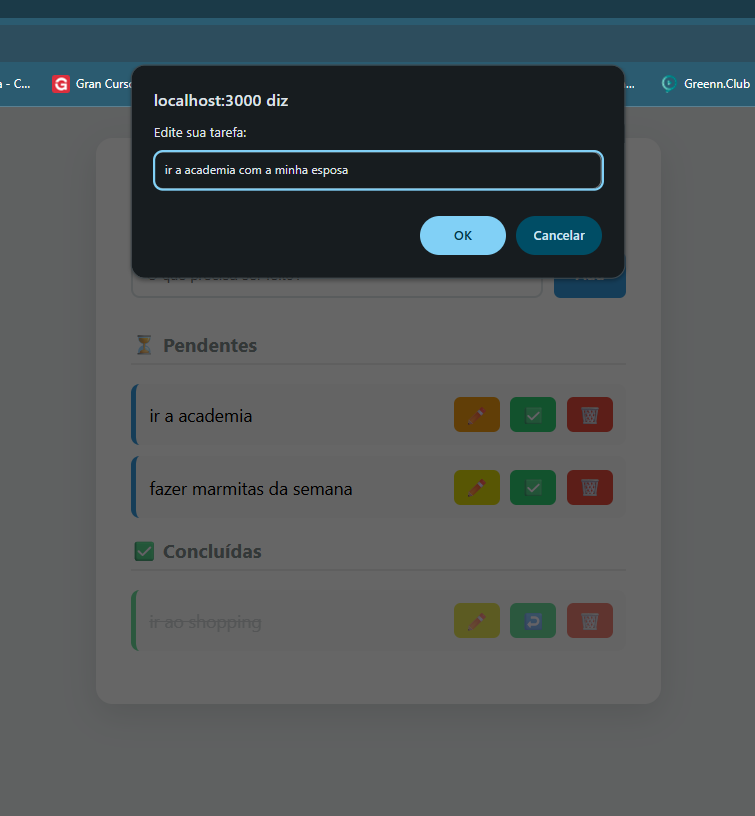
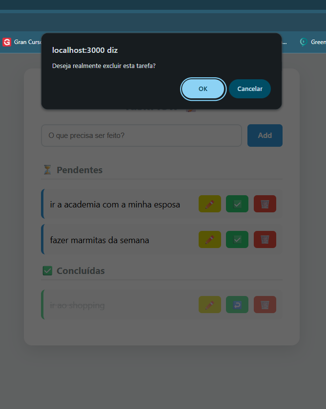
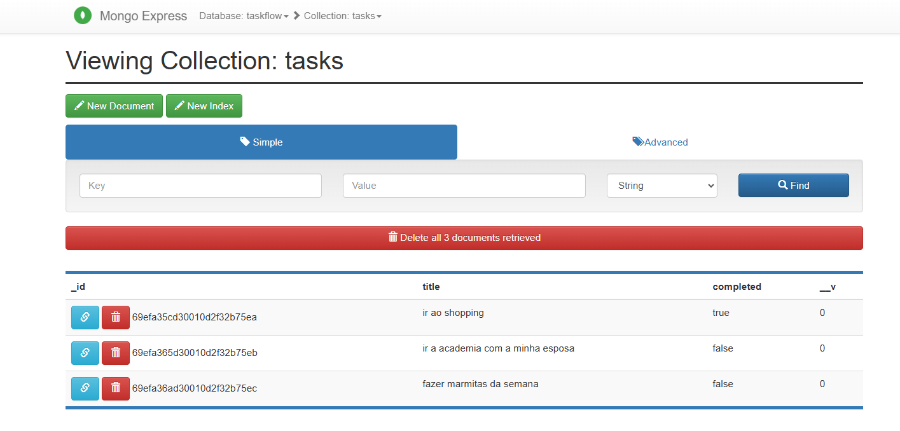

# 🧪 Plano de Testes e Qualidade (QA) - TaskFlow

Este documento descreve os testes realizados para garantir a estabilidade e o funcionamento da aplicação TaskFlow.

## 1. Testes de Ambiente (Docker)
- [x] **Persistência de Dados:** Validado que as tarefas permanecem salvas no MongoDB mesmo após o comando `docker compose down`.
- [x] **Isolamento:** Verificado que o Backend e o Frontend rodam em redes isoladas, comunicando-se apenas via orquestração do Docker.
- [x] **Interface do Banco:** Acesso ao Mongo Express (Porta 8081) validado para monitoramento em tempo real.

## 2. Testes de Funcionalidades (CRUD)
| Funcionalidade | Cenário de Teste | Resultado |
| :--- | :--- | :--- |
| **Criação** | Adicionar uma tarefa válida | ✅ Sucesso |
| **Validação** | Tentar adicionar tarefa com campo vazio | ✅ Bloqueado pelo Backend |
| **Listagem** | Exibição de tarefas vindas do MongoDB | ✅ Sucesso |
| **Status** | Marcar tarefa como concluída | ✅ Atualizado no Banco |
| **Exclusão** | Remover uma tarefa da lista | ✅ Removido do Banco |

### 📱 Interface da Aplicação e Listagem

*Validação da renderização das tarefas e do estado inicial do sistema.*

### ✏️ Fluxo de Edição (Update)

*Teste de alteração de dados via interface com prompt de edição.*

### 🗑️ Fluxo de Deleção (Delete)

*Validação da funcionalidade de remoção e confirmação de segurança.*

### 🗄️ Persistência no MongoDB (via Mongo Express)

*Comprovação de que os dados estão sendo devidamente armazenados no banco de dados Dockerizado.*

**Responsável pelo QA:** Rayssa